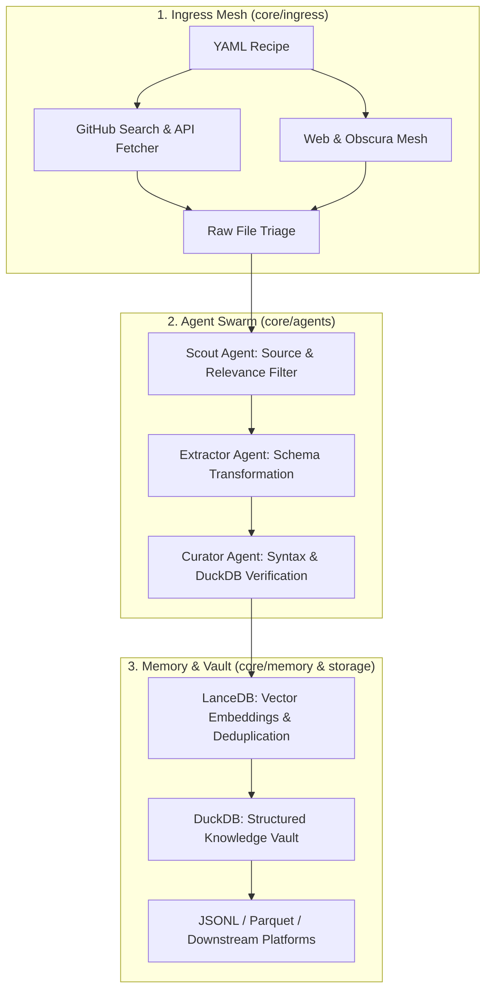

# 🌾 Kaizen Harvester (Sovereign Knowledge Harvester)

> **Autonomous multi-agent knowledge harvesting, extraction, deduplication, and distillation engine.**

`kaizen-harvester` is a sovereign data ingestion and knowledge distillation pipeline. It automates the discovery, extraction, verification, and vector-backed deduplication of technical practice challenges, educational datasets, architectural patterns, and domain knowledge from open sources (GitHub repositories, technical archives, and web endpoints).

---

## ⚡ Key Highlights

- **🎯 Declarative Harvesting Recipes (`recipes/*.yaml`)**: Define harvest domains, source queries, filters, and target extraction schemas with pure YAML.
- **🤖 Specialized Multi-Agent Swarm (`core/agents/`)**:
  - **Scout Agent**: Discovers candidate repositories, filters relevant files, and discards noise.
  - **Extractor Agent**: Converts heterogeneous text (Markdown, Jupyter notebooks, raw SQL scripts) into structured schema records via LLM intelligence.
  - **Curator Agent**: Enforces schema conformance, executes query sandboxing in DuckDB, verifies syntax, and assigns difficulty ratings.
- **🧠 Dual-Memory Engine (`core/memory/` & `storage/`)**:
  - **LanceDB**: Vector database storing dense text embeddings for real-time semantic deduplication and similarity clustering.
  - **DuckDB**: Fast in-process columnar analytical engine for structured catalog storage, validation, and analytics.
- **🖥️ Rich Terminal UI (`cli.py`)**: Real-time console visualization of harvest plans, progress tables, and vault statistics.

---

## 🏗️ System Architecture Overview



---

## 📁 Repository Structure

```
kaizen-harvester/
├── cli.py                     # Main CLI entrypoint (run, stats)
├── requirements.txt           # Python dependencies
├── .agents/                   # Kaizen Governor agentic skills & workflows
│   ├── AGENTS.md              # Master Kaizen Governor & branching guidelines
│   └── skills/                # plan, build, commit, pr, test, dev_env, etc.
├── core/
│   ├── __init__.py
│   ├── agents/                # Swarm agents (Scout, Extractor, Curator)
│   │   └── __init__.py
│   ├── ingress/               # Source collectors (GitHub, Web, Obscura)
│   │   └── __init__.py
│   └── memory/                # Storage layer (LanceDB vector + DuckDB relational)
│       └── __init__.py
├── recipes/                   # Declarative YAML harvesting recipes
│   └── sql_challenges.yaml    # SQL challenge extraction recipe
├── storage/                   # Local database & vector store artifacts
└── docs/                      # Comprehensive technical documentation
    ├── HLD.md                 # High-Level Design (System architecture & data flow)
    ├── LLD.md                 # Low-Level Design (Classes, schemas, & APIs)
    ├── recipes_guide.md       # Guide to creating and customizing YAML recipes
    ├── agent_swarm.md         # Multi-agent roles, prompts, and verification
    ├── storage_and_memory.md  # LanceDB deduplication & DuckDB vault design
    └── cli_reference.md       # CLI options, arguments, and environment setup
```

---

## 🚀 Quickstart

### 1. Prerequisites & Virtual Environment

Ensure Python 3.10+ is installed:

```bash
python3 -m venv venv
source venv/bin/activate
pip install -r requirements.txt
```

### 2. Configure Environment Variables

Create a `.env` file or export your API credentials:

```bash
export OPENAI_API_KEY="your-openai-key"        # Or ANTHROPIC_API_KEY
export GITHUB_TOKEN="your-github-token"        # For GitHub API ingress
```

### 3. Inspect Vault Statistics

Check the current counts in the LanceDB vector store and DuckDB records:

```bash
python cli.py stats
```

### 4. Execute a Recipe (Dry Run / Full Harvest)

Run the SQL challenge harvesting pipeline using a recipe:

```bash
python cli.py run --recipe recipes/sql_challenges.yaml
```

---

## 📖 Documentation Index

For complete architectural specifications, module breakdowns, and customization guides, consult the [docs/](file:///Users/mrrobot/Desktop/Projects/kaizen-harvester/docs/) folder:

| Document | Description |
|:---|:---|
| [**High-Level Design (HLD)**](file:///Users/mrrobot/Desktop/Projects/kaizen-harvester/docs/HLD.md) | System architecture, component boundaries, data pipeline stages, and flow diagrams. |
| [**Low-Level Design (LLD)**](file:///Users/mrrobot/Desktop/Projects/kaizen-harvester/docs/LLD.md) | Class models, component schemas, agent prompt structures, and database definitions. |
| [**Master Implementation Plan**](file:///Users/mrrobot/Desktop/Projects/kaizen-harvester/docs/PLAN.md) | 6-phase module-wise build plan with Karpathy, Loop, REACT & Harness engineering principles. |
| [**Recipes Guide**](file:///Users/mrrobot/Desktop/Projects/kaizen-harvester/docs/recipes_guide.md) | Specification for writing declarative YAML recipes, schemas, and target sources. |
| [**Agent Swarm**](file:///Users/mrrobot/Desktop/Projects/kaizen-harvester/docs/agent_swarm.md) | Detailed specifications for the Scout, Extractor, and Curator multi-agent system. |
| [**Storage & Memory Layer**](file:///Users/mrrobot/Desktop/Projects/kaizen-harvester/docs/storage_and_memory.md) | LanceDB vector deduplication mechanics and DuckDB relational vault schemas. |
| [**CLI Reference**](file:///Users/mrrobot/Desktop/Projects/kaizen-harvester/docs/cli_reference.md) | Full command-line interface documentation, flags, and runtime configurations. |

---

## 🛡️ License

Internal Sovereign Engineering Project. All rights reserved.
