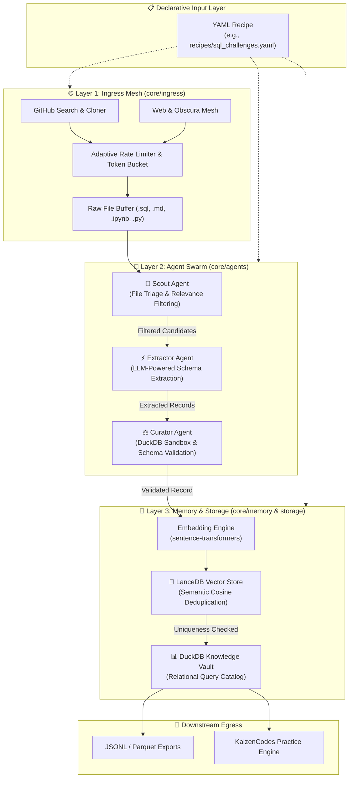
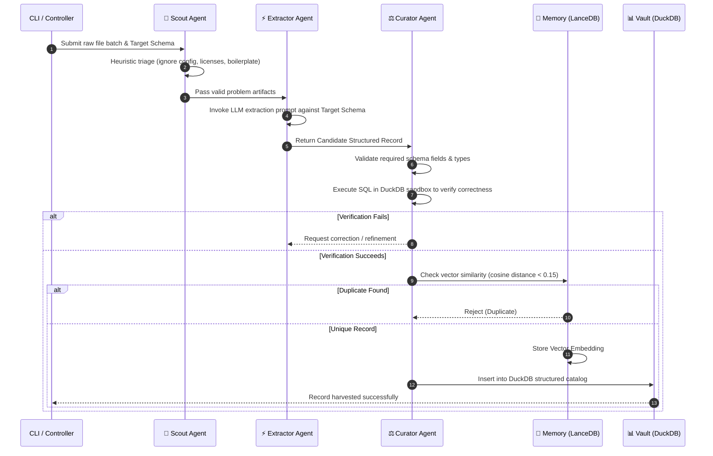

# 🏛️ Kaizen Harvester: Architecture & Technical Specification

## 1. System Vision & Purpose

**Kaizen Harvester** is a sovereign, autonomous multi-agent engine designed to discover, extract, curate, and deduplicate structured technical domain knowledge from across the open web, GitHub repositories, and developer knowledge archives.

While traditional scrapers rely on brittle regular expressions and fragile page scrapers, Kaizen Harvester combines **declarative recipe specifications**, **multi-agent reasoning (LLM)**, and **vector-native deduplication (LanceDB + DuckDB)** to build high-quality, normalized datasets ready for training, evaluation benchmarks, or interactive platforms.

---

## 2. High-Level Architecture Diagram



---

## 3. Core Architectural Subsystems

### 3.1 Declarative Ingress Mesh (`core/ingress`)

The Ingress Mesh is responsible for finding and acquiring raw data artifacts from distributed sources according to the recipe specification:

- **GitHub Search & Cloner (`core/ingress/github.py`)**:
  - Executes targeted GitHub API searches based on repository topics, search keywords, minimum star counts, and language filters.
  - Supports shallow cloning (`--depth 1`) and targeted file retrieval (fetching only `.md`, `.sql`, `.ipynb` files) to conserve bandwidth.
- **Obscura & Web Collector (`core/ingress/web.py`)**:
  - Crawls documentation hubs, problem sets, and web endpoints via asynchronous HTTP clients (`aiohttp`).
- **Rate-Limiting & Backoff (`core/ingress/rate_limiter.py`)**:
  - Implements exponential backoff and jitter to comply with GitHub API limits (5,000 req/hr authenticated) and web scraping etiquette.

---

### 3.2 Multi-Agent Swarm (`core/agents`)

The agent swarm is orchestrated as a sequential pipeline with feedback loops:



#### Roles & Responsibilities:

1. **Scout Agent (`core/agents/scout.py`)**:
   - Analyzes repository directory trees and raw file content.
   - Evaluates whether a file contains technical challenge definitions or setup DDL vs. unrelated build configs or licenses.
   - Outputs a prioritized queue of files for extraction.

2. **Extractor Agent (`core/agents/extractor.py`)**:
   - Takes raw unstructured content and transforms it into the recipe's `target_schema`.
   - Parses code blocks, markdown problem statements, solution queries, and input/output tables.
   - Normalizes field names and maps data into well-formed JSON objects.

3. **Curator Agent (`core/agents/curator.py`)**:
   - **Syntax & Execution Verification**: Executes SQL scripts directly in DuckDB sandbox to ensure DDL compiles and solution queries run without syntax errors.
   - **Quality Scoring**: Assigns difficulty ratings (`Easy`, `Medium`, `Hard`) and classifies dialects (`PostgreSQL`, `MySQL`, `DuckDB`, `Spark SQL`).
   - **Enforces Cleanliness**: Strips proprietary watermarks and ensures schema completeness.

---

### 3.3 Dual-Memory & Vault Engine (`core/memory` & `storage/`)

Kaizen Harvester employs a two-tier storage paradigm combining vector similarity memory with a columnar relational database:

| Component | Technology | Primary Role | Location |
|:---|:---|:---|:---|
| **Vector Memory** | [LanceDB](https://lancedb.com) + `sentence-transformers` | Semantic similarity search, deduplication across platforms (e.g. detecting identical LeetCode/DataLemur questions rewritten with different names). | `storage/lancedb/` |
| **Relational Vault** | [DuckDB](https://duckdb.org) | Columnar storage for validated records, lightning-fast analytical queries, aggregation metrics, and export staging. | `storage/vault.duckdb` |

---

## 4. End-to-End Data Pipeline Stages

```
┌─────────────────┐
│ 1. INGRESS      │ --> GitHub API / Web Mesh pulls raw files (.sql, .md, .ipynb)
└────────┬────────┘
         ▼
┌─────────────────┐
│ 2. SCOUT        │ --> File triage filter drops non-conforming & noise files
└────────┬────────┘
         ▼
┌─────────────────┐
│ 3. EXTRACT      │ --> LLM parses unstructured content into Target Schema JSON
└────────┬────────┘
         ▼
┌─────────────────┐
│ 4. CURATE       │ --> DuckDB sandboxing validates SQL and schema integrity
└────────┬────────┘
         ▼
┌─────────────────┐
│ 5. DEDUPLICATE  │ --> LanceDB checks cosine similarity against existing vectors
└────────┬────────┘
         ▼
┌─────────────────┐
│ 6. STORE        │ --> Stored into DuckDB catalog for export and platform use
└─────────────────┘
```

---

## 5. Extensibility & Design Principles

1. **Sovereignty**: Complete local persistence without mandatory cloud lock-in.
2. **Deterministic Quality Gates**: Every extracted code snippet must execute in a local sandbox (DuckDB) before being committed to storage.
3. **Pluggable LLM Backends**: Seamless support for Anthropic Claude 3.7 / 3.5, OpenAI GPT-4o, and local models.
4. **Surgical Modularity**: Ingress, Agent Swarms, and Storage Layers are decoupled through typed Python data classes and Pydantic schemas.
