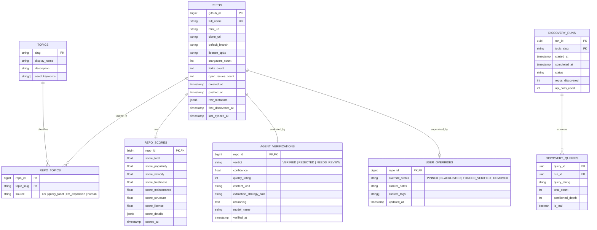

# Project 1 — GitHub Knowledge Map (`p1-map`)
## Concept & Architectural Specification

_Created: 2026-09-12_  
_Status: Approved for Implementation Planning_  
_Workspace: `kaizen-harvester` monorepo (`projects/p1-map`)_

---

## 1. Executive Summary & Objective

**Mission:** Answer *"Where is the highest quality material for topic $X$ on GitHub?"* and construct a continuously updated, verified catalog of learning repositories, challenge sets, and open datasets **before any file scraping, heavy disk cloning, or expensive LLM extraction occurs**.

P1 is a **map and catalog engine**, not a scraper:
- **Consumes:** GitHub Search API, GraphQL API, and Git Trees metadata.
- **Produces:** Scored, AI-verified, and human-curated repository maps.
- **Dominant Bottleneck:** GitHub API quotas (Search: 30 req/min, Core/GraphQL: 5,000 req/hr).
- **Core Principle:** **Zero human bottlenecks.** AI Agent verification is **mandatory and automatic** on every discovered repository; human verification is **optional and supervisory**.

---

## 2. Boundary Invariants & Monorepo Contracts

1. **Storage Isolation:** P1 owns its PostgreSQL database (`p1_knowledge_map`). Downstream projects (P2 Ingestion, P3 Generation) **never** run SQL queries or joins against P1 tables.
2. **Published Export Contract:** P2 consumes P1 via immutable versioned exports conforming to `packages/contracts/p1_export.py`.
3. **Zero Content Scraping in P1:** P1 inspects metadata, file trees, and README snippets via the GitHub API. It **never** downloads multi-gigabyte archives or clones full repositories to disk. Full cloning is strictly deferred to P2.

---

## 3. GitHub API Constraint & Query Planner

### 3.1 The Fundamental Constraint
Direct probing of the GitHub API confirms:
- Searching `q=sql` reports over **1.4 million repositories**.
- GitHub caps pagination at page 10 (`per_page=100`), meaning **only the first 1,000 results are accessible** per search query.
- Authenticated rate limits: **30 search req/min**, **5,000 core/GraphQL req/hr**.

A single search query misses >99.9% of matching repositories. P1's primary algorithmic intelligence is **Deterministic Query Planning and Recursive Partitioning**.

```
                           [ Topic: "SQL" ]
                                  │
                      (Topic Expander: LLM)
                                  │
           ┌──────────────────────┴──────────────────────┐
       "sql"              "sql-interview"          "postgresql"
         │                       │                       │
  (total_count: 1.4M)     (total_count: 1.2K)     (total_count: 450K)
         │                       │                       │
 [Recursive Split]       [Recursive Split]       [Recursive Split]
    stars:>5000             stars:>100              stars:>2000
    stars:2000..4999        stars:20..99            stars:500..1999
    stars:1000..1999        stars:0..19             ...
    ...
```

### 3.2 Query Partitioning Algorithm
1. **Topic Expansion (LLM - 1 call per run):**
   - Expands a canonical topic (e.g. `"SQL"`) into semantic synonyms, GitHub topics, and related keywords (`sql-interview`, `leetcode-sql`, `postgres-exercises`, `dbms`, `tsql`).
2. **Deterministic Partitioning Loop (0 LLM tokens):**
   - For each query facet, probe GitHub with `per_page=1` to inspect `total_count`.
   - **If `total_count <= 1000`:** The slice is complete. Enqueue for pagination (`per_page=100`, pages 1..10).
   - **If `total_count > 1000`:** Subdivide recursively along the **stars axis**:
     - `stars:>5000`
     - `stars:2000..4999`
     - `stars:1000..1999`
     - `stars:500..999`
     - `stars:200..499`
     - `stars:50..199`
     - `stars:10..49`
   - If any star bucket still reports `> 1000` results, further subdivide by **`created:` or `pushed:` date windows** (e.g., `created:2023-01-01..2023-12-31`).
3. **Rate Limiting & GraphQL Batching:**
   - **Search:** Enforces a token bucket at 25 req/min (safety margin under the 30/min cap).
   - **Enrichment:** Converts candidate repo IDs into batch GraphQL queries (`repository(owner, name) { ... }`), fetching ~100 repos per single HTTP request against the 5,000/hr quota.

---

## 4. Deterministic Multi-Factor Scoring Model

To keep rankings transparent, debuggable, and contestable, **every scoring component is stored separately**.

$$\text{Total Score} = w_{pop} S_{pop} + w_{vel} S_{vel} + w_{fresh} S_{fresh} + w_{maint} S_{maint} + w_{struct} S_{struct} + w_{lic} S_{lic}$$

| Metric Component | Formula / Input | Purpose |
| :--- | :--- | :--- |
| **Popularity ($S_{pop}$)** | $\log_{10}(\text{stars} + 1) \times 0.7 + \log_{10}(\text{forks} + 1) \times 0.3$ | Signals community validation. |
| **Velocity ($S_{vel}$)** | $\frac{\text{stars}}{\text{repo\_age\_days}}$ normalized against domain peak | Elevates rapidly adopted new resources; penalizes stale decade-old repos. |
| **Freshness ($S_{fresh}$)** | $\exp(-\lambda \cdot \text{days\_since\_pushed})$ where $\lambda = \frac{\ln(2)}{365}$ | 1-year half-life on last commit activity. |
| **Maintenance ($S_{maint}$)** | $\frac{\text{closed\_issues}}{\text{open\_issues} + \text{closed\_issues} + 1}$ | Rewards actively maintained repositories. |
| **Structure ($S_{struct}$)** | Ratio of markdown, notebooks, SQL, code files vs binary blobs | Penalizes empty placeholder repos or raw binary dumps. |
| **License ($S_{lic}$)** | Permissive (1.0: MIT/Apache/BSD) · Copyleft (0.6: GPL) · Unlicensed (0.0) | Critical for legal redistribution downstream in P3. |

### Default Exclusion Filters
- `archived == true` (ignored by default unless forced).
- `fork == true` (ignored to avoid duplicated indexing of upstream repos).
- Repositories with $< 10$ stars and no commits in $> 2$ years.

---

## 5. Mandatory AI Verifier Agent (Automated Curation)

> [!IMPORTANT]
> **Zero Human Gatekeeping:** A human curator is never required for a repository to progress into the map. Every repository passing the score threshold is automatically evaluated and verified by an AI Verifier Agent.

```
       Candidate Repos (Score > Threshold)
                       │
                       ▼
       ┌───────────────────────────────┐
       │   AI VERIFIER AGENT (LLM)     │
       │   • Probes README & Git Tree  │
       │   • Analyzes Substance & Type │
       │   • Flags Junk / Spam / Stubs │
       └───────────────────────────────┘
                       │
        ┌──────────────┴──────────────┐
        ▼                             ▼
   [ VERIFIED ]                  [ REJECTED ]
        │                             │
   Stored in DB                  Stored in DB
 (Ready for P2)                (Pruned from P2)
        │
        ▼
   (Optional: Human can inspect or override at any time)
```

### 5.1 Inspection Payload (Lightweight)
The agent does not clone the repo. It requests:
1. `GET /repos/{owner}/{repo}/git/trees/{branch}?recursive=1` (file paths and sizes).
2. `README.md` raw content (truncated to top 2,500 tokens).

### 5.2 Verification Checkpoints
- **Substance Check:** Confirms presence of real problems, solutions, schemas, code patterns, or dataset records (rejects empty repos, student homework copies, or link farms).
- **Taxonomy Classification:** Categorizes content into `interview_questions`, `practice_challenges`, `tabular_dataset`, `course_curriculum`, `reference_docs`, `tool_or_library`, or `junk_or_spam`.
- **Extraction Strategy Hint:** Supplies P2 with the optimal extraction approach:
  - `fan_out_headings`: Single large markdown containing many sub-problems.
  - `per_file_code`: Dedicated directory with one problem/script per file.
  - `notebook_cells`: Jupyter notebooks requiring cell-level splitting.
  - `duckdb_profiler`: CSV/Parquet dataset (0 LLM tokens, route to DuckDB).
  - `skip`: Not suitable for automated ingestion.

### 5.3 Agent Verdict Schema
```python
class AgentVerificationVerdict(BaseModel):
    repo_id: int
    verdict: Literal["VERIFIED", "REJECTED", "NEEDS_REVIEW"]
    confidence: float  # 0.0 to 1.0
    quality_rating: int  # 1 to 5
    content_kind: str
    extraction_strategy_hint: str
    reasoning: str
    verified_at: datetime
    model_name: str
```

---

## 6. Optional Human Curation & Overrides

Human curation is a **supervisory layer**, accessed via CLI or Web Dashboard:
- Curators can review ranked leaderboards by topic.
- Inspect the breakdown of deterministic scores and AI Agent reasoning.
- Apply high-leverage actions:
  - **Pin:** Guarantee repository inclusion in P2 exports.
  - **Blacklist:** Permanently block a repository from ever being harvested.
  - **Force Verify / Reject:** Overrule the AI Agent verdict.
  - **Re-tag:** Correct topic taxonomies.

### Effective Status Precedence
```
Effective Status = Human Override (if present) ELSE AI Agent Verdict
```
Human decisions are stored in `user_overrides` so subsequent discovery runs **never overwrite human judgment**.

---

## 7. Data Architecture (PostgreSQL)



---

## 8. Export Contract (P1 → P2 Handshake)

P2 receives an immutable JSON/Parquet export or reads a dedicated view from P1 conforming to this Pydantic contract:

```python
class CuratedRepoExport(BaseModel):
    github_id: int
    full_name: str
    clone_url: str
    default_branch: str
    commit_sha: Optional[str] = None
    license_spdx: Optional[str]
    effective_status: Literal["PINNED", "VERIFIED"]
    content_kind: str
    extraction_strategy_hint: str
    quality_rating: int
    score_total: float
    topics: List[str]
    exported_at: datetime
```

---

## 9. Verification & Exit Gates for P1

P1 is complete and ready for P2 integration when:
1. **Partitioning Proof:** For a major topic (`"sql"` or `"python"`), the recursive partitioner retrieves distinct candidate repos beyond the 1,000-result ceiling without exceeding GitHub's 30/min rate limit or triggering HTTP 403.
2. **Deterministic Scorer:** Scores 500+ discovered repositories with component breakdowns stored in Postgres.
3. **Autonomous AI Verification:** The AI Verifier Agent processes scored candidates, correctly rejecting junk/homework repos and assigning verified flags and extraction hints with $>85\%$ spot-check accuracy.
4. **Idempotence & Override Survival:** Re-running discovery on an existing topic updates stats but preserves all `user_overrides` and AI verification histories.
5. **Contract Export:** Successfully serializes a verified repository manifest conforming to `CuratedRepoExport`.
