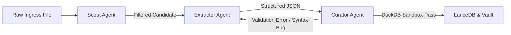

# 🤖 Agent Swarm Specifications & Roles

## 1. Overview

**Kaizen Harvester** employs a specialized, collaborative multi-agent architecture in `core/agents/`. Rather than relying on a single monolithic LLM prompt to ingest, parse, and validate complex files, work is divided across three dedicated agents:

1. **🔭 Scout Agent**: Triage, discovery, and relevance filtering.
2. **⚡ Extractor Agent**: Semantic parsing and structured schema extraction.
3. **⚖️ Curator Agent**: Sandboxed execution, SQL verification, quality scoring, and data normalization.



---

## 2. Agent 1: Scout Agent (`core/agents/scout.py`)

### Role & Purpose
The Scout Agent is the first line of defense against noise. It examines repository directory structures, file paths, file extensions, and preview snippets to determine whether an asset contains valuable problem statements or is merely boilerplate (e.g., CI/CD workflows, licenses, package lockfiles, setup scripts).

### Heuristics & Filtering Rules
- **Include Criteria**:
  - Files containing SQL keywords: `CREATE TABLE`, `INSERT INTO`, `SELECT`, `WITH`, `OVER (PARTITION BY)`.
  - Markdown files with problem headers: `## Problem`, `## Question`, `### Description`, `Input:`, `Output:`.
  - Jupyter Notebooks with markdown explanation cells alongside SQL/Python execution cells.
- **Exclude Criteria**:
  - Package locks (`package-lock.json`, `poetry.lock`, `Cargo.lock`).
  - License files (`LICENSE`, `COPYING`).
  - Config files (`.prettierrc`, `.gitignore`, `tsconfig.json`).
  - Minified assets or binary artifacts.

### Scout Agent System Prompt (Reference)
```markdown
You are the Scout Agent of Kaizen Harvester.
Your objective is to evaluate raw file paths and brief header snippets to decide if the file contains authentic problem statements, technical patterns, or challenge definitions matching the target domain: {{domain}}.

Input:
- File path: {{file_path}}
- File snippet: {{file_head}}

Output:
Return a JSON object:
{
  "is_candidate": true | false,
  "confidence_score": 0.0 - 1.0,
  "primary_format": "markdown" | "sql" | "jupyter" | "code",
  "reason": "Concise justification"
}
```

---

## 3. Agent 2: Extractor Agent (`core/agents/extractor.py`)

### Role & Purpose
The Extractor Agent receives qualified raw content and transforms unstructured text, code fences, and tables into strict JSON conforming to the recipe's `target_schema`.

### Key Capabilities
- **Multi-Format Ingestion**:
  - Extracts text and code blocks from `.md` files.
  - Extracts raw statements and comments from `.sql` files.
  - Extracts markdown cells and code cells from `.ipynb` (Jupyter) JSON structures.
- **Strict Schema Adherence**: Maps title, problem description, setup DDL, solution query, and metadata directly to target fields.
- **Separation of Concerns**: Decouples the setup DDL (`CREATE TABLE ...`, `INSERT INTO ...`) from the actual solution SQL query (`SELECT ...`).

### Extractor Agent System Prompt (Reference)
```markdown
You are the Extractor Agent of Kaizen Harvester.
Your task is to parse raw content and extract structured fields according to the Target Schema:
{{target_schema_json}}

Rules:
1. Isolate the setup DDL (CREATE TABLE / INSERT INTO) cleanly into `setup_ddl`.
2. Extract ONLY the solution query into `solution_sql`. Do not include comments or setup code in `solution_sql`.
3. Provide a clear, self-contained `problem_statement` in markdown format.
4. Output valid JSON matching the exact keys requested.
```

---

## 4. Agent 3: Curator Agent (`core/agents/curator.py`)

### Role & Purpose
The Curator Agent is the automated quality gatekeeper. It does not merely trust the LLM output; it empirically verifies extracted code and enforces structural integrity.

### Verification Capabilities:

1. **DuckDB Sandboxing**:
   - Spawns an ephemeral in-memory DuckDB instance (`duckdb.connect(":memory:")`).
   - Executes the extracted `setup_ddl` to create tables and insert mock rows.
   - Executes the extracted `solution_sql` against the mock tables.
   - Checks for syntax errors, ambiguous column names, or runtime failures.

2. **Self-Correction Feedback Loop**:
   - If DuckDB fails during execution (e.g. invalid syntax, missing column in DDL), the error trace is sent back to the Extractor Agent with instructions to fix the issue.

3. **Difficulty & Metadata Classification**:
   - Analyzes query complexity:
     - `Easy`: Simple `SELECT`, `WHERE`, `GROUP BY`, `ORDER BY`, single join.
     - `Medium`: Multi-table `JOIN`, subqueries, date manipulation, basic `WITH` CTEs.
     - `Hard`: Window functions (`ROW_NUMBER`, `DENSE_RANK`, `LAG`/`LEAD`), recursive CTEs, `QUALIFY`, Gaps & Islands.
   - Identifies dialect compatibility: `PostgreSQL`, `MySQL`, `DuckDB`, `Spark SQL`.

---

## 5. Agent Swarm Execution Protocol

```
1. Ingress Buffer provides file -> Scout Agent
   ├── Discarded -> Logged as skipped
   └── Approved  -> Sent to Extractor Agent

2. Extractor Agent invokes LLM -> Produces candidate JSON

3. Curator Agent evaluates candidate JSON
   ├── Step 3.1: Schema field and enum validation
   ├── Step 3.2: DuckDB execution sandbox verification
   ├── Step 3.3: Complexity & difficulty assignment
   └── If error:
         Return error to Extractor (Max retries: 2)
       If success:
         Forward to LanceDB / DuckDB Storage Layer
```
