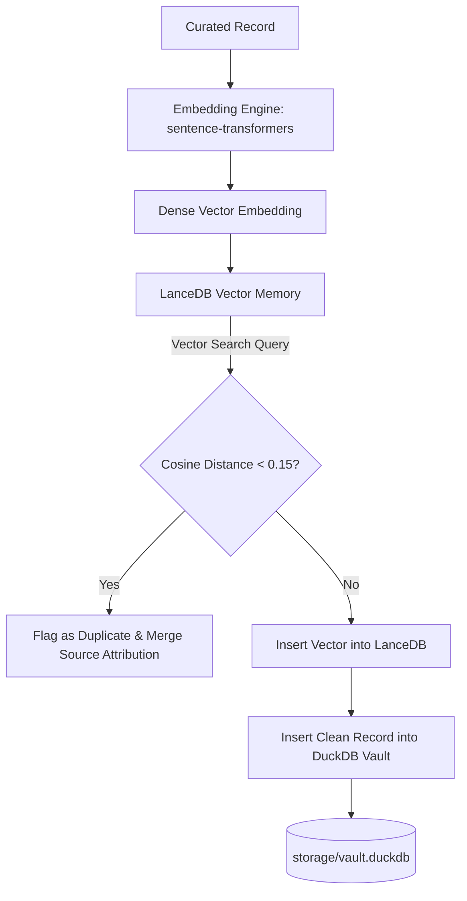

# 💾 Storage & Memory Architecture: LanceDB + DuckDB

## 1. Architectural Philosophy

A major challenge when harvesting domain knowledge from thousands of public repositories is **data duplication and quality drift**. For example, the classic "Second Highest Salary" or "Consecutive Numbers" problem appears in hundreds of GitHub repos with slight variations in column names, table names, or markdown formatting.

To address this, **Kaizen Harvester** uses a dual-engine storage architecture:

1. **LanceDB Vector Memory (`core/memory/lancedb_store.py`)**: High-dimensional vector space for semantic similarity search and near-duplicate detection.
2. **DuckDB Structured Vault (`core/memory/duckdb_store.py`)**: In-process columnar relational database for validated challenge records, execution metadata, and analytical queries.



---

## 2. LanceDB Vector Memory & Semantic Deduplication

### 2.1 Embedding Generation
When a problem statement is verified by the Curator Agent, its normalized representation (title + problem statement text) is embedded using a dense embedding model (e.g., `all-MiniLM-L6-v2` or `BAAI/bge-small-en-v1.5` via `sentence-transformers`):

```python
from sentence_transformers import SentenceTransformer

embedder = SentenceTransformer("all-MiniLM-L6-v2")
vector = embedder.encode(f"{record['title']}\n{record['problem_statement']}").tolist()
```

### 2.2 Semantic Deduplication Logic
Before writing a record to persistent storage, LanceDB performs an Approximate Nearest Neighbor (ANN) vector search:

```python
results = table.search(vector).limit(3).to_list()

for match in results:
    distance = match["_distance"]
    if distance < 0.15:  # High similarity threshold
        # Merge source repository attribution into existing record
        merge_source_attribution(match["id"], source_url)
        return DuplicateRejection(existing_id=match["id"], similarity=1 - distance)
```

- **Threshold < 0.15**: Identical or near-identical problem statement (rejects duplicate, adds source reference).
- **Threshold 0.15 - 0.35**: Related variation or sub-problem (flags for review).
- **Threshold > 0.35**: Completely novel challenge (approved for storage).

---

## 3. DuckDB Relational Knowledge Vault

Validated, unique records are persisted in a local DuckDB database file (`storage/vault.duckdb`).

### 3.1 Relational Schema

```sql
-- Table 1: Harvested Challenges Catalog
CREATE TABLE IF NOT EXISTS challenges (
    id VARCHAR PRIMARY KEY,
    domain VARCHAR NOT NULL,
    title VARCHAR NOT NULL,
    problem_statement TEXT NOT NULL,
    setup_ddl TEXT NOT NULL,
    solution_sql TEXT NOT NULL,
    dialect VARCHAR NOT NULL,
    difficulty VARCHAR NOT NULL,
    category VARCHAR,
    tags VARCHAR[],
    source_repos VARCHAR[],
    quality_score FLOAT,
    created_at TIMESTAMP DEFAULT CURRENT_TIMESTAMP,
    updated_at TIMESTAMP DEFAULT CURRENT_TIMESTAMP
);

-- Table 2: Harvest Run Telemetry & Logs
CREATE TABLE IF NOT EXISTS harvest_runs (
    run_id VARCHAR PRIMARY KEY,
    recipe_name VARCHAR NOT NULL,
    started_at TIMESTAMP,
    completed_at TIMESTAMP,
    items_scanned INTEGER,
    items_extracted INTEGER,
    items_deduplicated INTEGER,
    items_saved INTEGER,
    status VARCHAR
);
```

### 3.2 Vault Statistics & Analytics (`cli.py stats`)

DuckDB allows instant analytical aggregation across the entire harvest vault:

```python
import duckdb

con = duckdb.connect("storage/vault.duckdb")

# Total counts & breakdown by difficulty
stats = con.execute("""
    SELECT 
        difficulty,
        dialect,
        COUNT(*) as total_challenges
    FROM challenges
    GROUP BY difficulty, dialect
    ORDER BY total_challenges DESC
""").df()
```

---

## 4. Storage Artifacts Directory Layout

All physical databases and vector embeddings are stored locally under `storage/`:

```
storage/
├── lancedb/                  # LanceDB vector tables (.lance format)
│   ├── challenges.lance/
│   │   ├── _versions/
│   │   └── data/
├── vault.duckdb              # Primary DuckDB columnar catalog
├── vault.duckdb.wal          # Write-ahead log (temporary during transactions)
└── exports/                  # Staging for downstream JSONL/Parquet exports
    ├── sql_challenges_v1.jsonl
    └── sql_challenges_v1.parquet
```

---

## 5. Exporting to Downstream Platforms

Harvested knowledge can be exported directly from DuckDB into standard analytical formats:

### Export to JSONL:
```sql
COPY challenges TO 'storage/exports/challenges.jsonl' (FORMAT JSON);
```

### Export to Apache Parquet:
```sql
COPY challenges TO 'storage/exports/challenges.parquet' (FORMAT PARQUET, COMPRESSION ZSTD);
```
